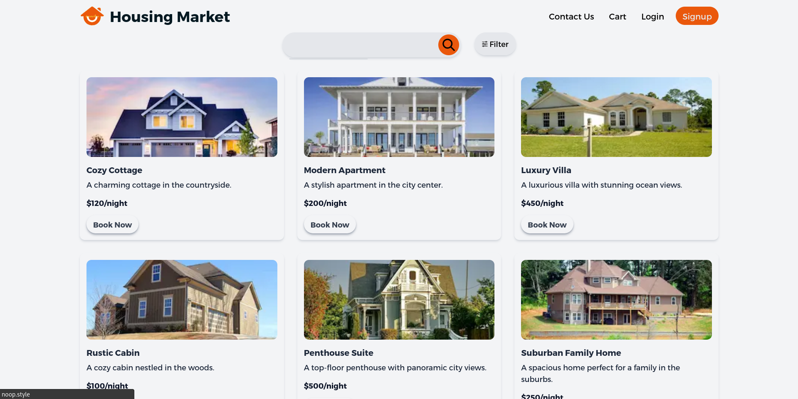
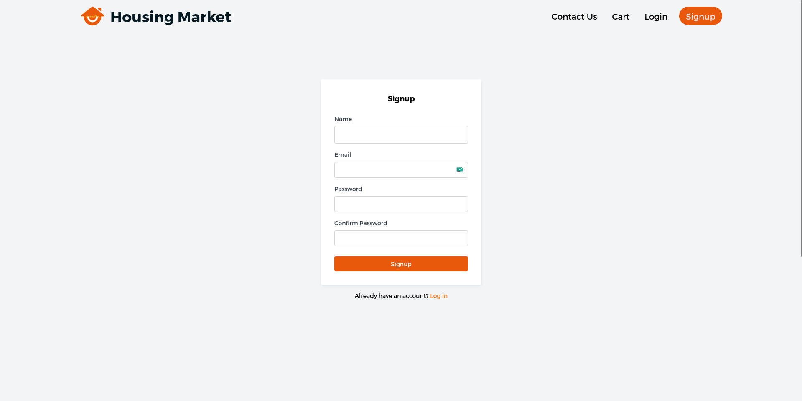

# Totality Frontend Challenge

A responsive Rental Housing Marketplace frontend with multiple cart systems, booking management, smooth transitions, and a clean UI. Built with Next.js, TypeScript, Tailwind CSS, and GSAP animations.


## Table of Contents

- [Installation](#installation)
- [Usage](#usage)
- [Features](#features)
- [Contributing](#contributing)
- [License](#license)
- [Contact](#contact)
- [Acknowledgments](#acknowledgments)

## Installation

To set up the project locally, follow these steps:

1. Clone the repository:
   ```bash
   git clone https://github.com/username/totality-frontend-challenge.git
   ```
2. Navigate to the project directory:
   ```bash
   cd totality-frontend-challenge
   ```
3. Install the necessary dependencies:
   ```bash
   npm install next gsap typescript tailwindcss @herotofu/react
   ```
4. Run the development server:
   ```bash
   npm run dev
   ```

## Usage

Once installed, you can start the development server and access the project at http://localhost:3000. Below is a walkthrough of the main features, with accompanying screenshots:

1. Property Listing

When you first open the website at localhost:3000, you will be greeted by the property listing page.


2. Location Search

Clicking on the search bar reveals the available property locations. After selecting a location and clicking the search button, the search will be implemented, filtering the properties accordingly.


3. Filter Popup

By clicking the filter button, a popup will appear over the screen, allowing you to sort and filter the properties based on various criteria.


4. Booking a Property

Each property card has a "Book Now" button. When clicked, a small popup will confirm that the item has been added to your cart.


5. Cart Details

Clicking "Go to Cart" within the booking confirmation popup will take you to the cart page, where a more detailed version of the selected property is displayed.


6. Checkout Process

On the cart page, clicking the "Checkout" button will open a form where you can enter your details to complete the booking process.


7. Functional Contact Us Form

The application includes a fully functional "Contact Us" form. When submitted, the form details are sent directly to me.


8. Login Form

A simple, yet elegant login form is provided as part of the frontend, allowing users to enter their credentials.


9. Signup Page

Similarly, a signup page is included, which is also part of the frontend implementation.


## Features

- **Component-Based Architecture**: Code is structured using reusable components to ensure modularity and maintainability.
- **Booking System**: Users can book properties, which are then saved into the cart section for later checkout.
- **Filter Component**: A powerful filter component that enables users to filter properties based on specific criteria.
- **Customizable Checkout Bar**: The checkout process is flexible and can be tailored to the user's needs.
- **Responsive Design**: The UI is fully responsive and works seamlessly across all devices, ensuring a consistent experience.

## Contributing

Contributions are what make the open-source community such a wonderful place to learn, inspire, and create. Any contributions you make are **greatly appreciated**.

1. Fork the Project
2. Create your Feature Branch (`git checkout -b feature/AmazingFeature`)
3. Commit your Changes (`git commit -m 'Add some AmazingFeature'`)
4. Push to the Branch (`git push origin feature/AmazingFeature`)
5. Open a Pull Request

## License

This project is licensed under the MIT License - see the [LICENSE](LICENSE) file for details.

## Contact

Vishal Aditya Kirtaniya - [LinkedIn](https://www.linkedin.com/in/vishalkirtaniya) - vishalkirtaniyaofficial@gmail.com

## Acknowledgments

- [Next.js Documentation](https://nextjs.org/docs)
- [TypeScript Documentation](https://www.typescriptlang.org/docs/)
- [Tailwind CSS Documentation](https://tailwindcss.com/docs)
- [GSAP Documentation](https://greensock.com/docs/)
- [HeroTofu](https://herotofu.com/)
